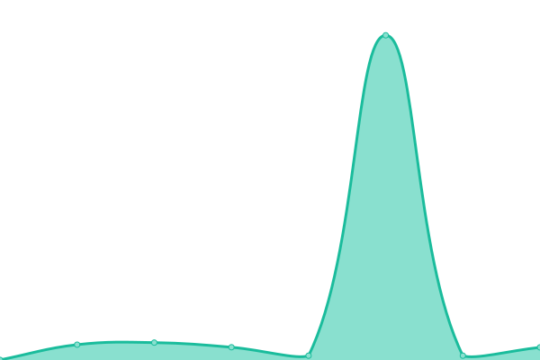
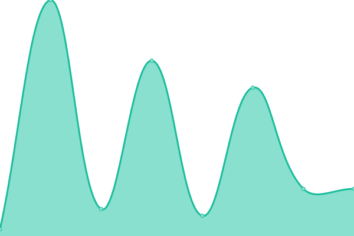
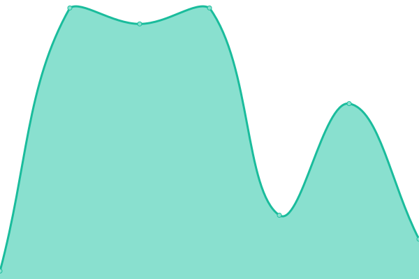
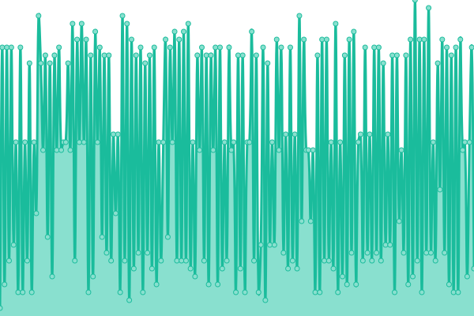
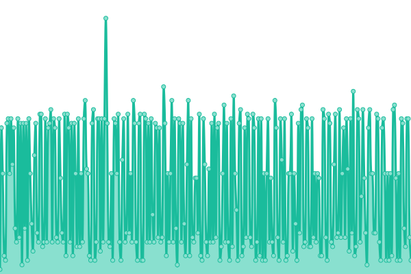
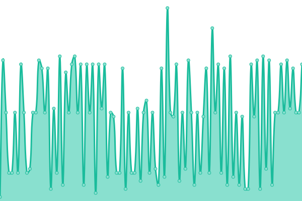

# [📈 Live Status](https://upptime.github.io/upptime): <!--live status--> **🟥 Complete outage**

This repository contains the open-source uptime monitor and status page for [Upptime](https://upptime.js.org), powered by [Upptime](https://github.com/upptime/upptime).

With [Upptime](https://upptime.js.org), you can get your own unlimited and free uptime monitor and status page, powered entirely by a GitHub repository. We use [Issues](https://github.com/upptime/upptime/issues) as incident reports, [Actions](https://github.com/malik106/qst-client-status-all/actions) as uptime monitors, and [Pages](https://upptime.github.io/upptime) for the status page.

<!--start: status pages-->
<!-- This summary is generated by Upptime (https://github.com/upptime/upptime) -->
<!-- Do not edit this manually, your changes will be overwritten -->
<!-- prettier-ignore -->
| URL | Status | History | Response Time | Uptime |
| --- | ------ | ------- | ------------- | ------ |
|  [Gateway Service](https://quessttechnologies.com/gateway/healthcheck) | 🟥 Down | [gateway-service.yml](https://github.com/quesst-technologies/qst-admin-status-all/commits/HEAD/history/gateway-service.yml) | 

 0ms
     
 | 

<a href="https://status.admin.quessttechnologies.com/history/gateway-service">0.00%</a>
    

|  [Analytics Service](https://quessttechnologies.com/analytics/healthcheck) | 🟥 Down | [analytics-service.yml](https://github.com/quesst-technologies/qst-admin-status-all/commits/HEAD/history/analytics-service.yml) | 

 0ms
     
 | 

<a href="https://status.admin.quessttechnologies.com/history/analytics-service">0.00%</a>
    

|  [Api Service](https://quessttechnologies.com/api/healthcheck) | 🟥 Down | [api-service.yml](https://github.com/quesst-technologies/qst-admin-status-all/commits/HEAD/history/api-service.yml) | 

 0ms
     
 | 

<a href="https://status.admin.quessttechnologies.com/history/api-service">0.00%</a>
    

|  [Cron Service](https://quessttechnologies.com/cron/healthcheck) | 🟥 Down | [cron-service.yml](https://github.com/quesst-technologies/qst-admin-status-all/commits/HEAD/history/cron-service.yml) | 

 0ms
     
 | 

<a href="https://status.admin.quessttechnologies.com/history/cron-service">0.00%</a>
    

|  [Email Service](https://quessttechnologies.com/email/healthcheck) | 🟥 Down | [email-service.yml](https://github.com/quesst-technologies/qst-admin-status-all/commits/HEAD/history/email-service.yml) | 

 0ms
     
 | 

<a href="https://status.admin.quessttechnologies.com/history/email-service">0.00%</a>
    

|  [Frontend Service](https://quessttechnologies.com/frontend/healthcheck) | 🟥 Down | [frontend-service.yml](https://github.com/quesst-technologies/qst-admin-status-all/commits/HEAD/history/frontend-service.yml) | 

 0ms
     
 | 

<a href="https://status.admin.quessttechnologies.com/history/frontend-service">0.00%</a>
    

|  [Notifications Service](https://quessttechnologies.com/notifications/healthcheck) | 🟥 Down | [notifications-service.yml](https://github.com/quesst-technologies/qst-admin-status-all/commits/HEAD/history/notifications-service.yml) | 

 0ms
     
 | 

<a href="https://status.admin.quessttechnologies.com/history/notifications-service">0.00%</a>
    

|  [Search Service](https://quessttechnologies.com/search/healthcheck) | 🟥 Down | [search-service.yml](https://github.com/quesst-technologies/qst-admin-status-all/commits/HEAD/history/search-service.yml) | 

 0ms
     
 | 

<a href="https://status.admin.quessttechnologies.com/history/search-service">0.00%</a>
    

|  [Socket Service](https://quessttechnologies.com/socket/healthcheck) | 🟥 Down | [socket-service.yml](https://github.com/quesst-technologies/qst-admin-status-all/commits/HEAD/history/socket-service.yml) | 

 0ms
     
 | 

<a href="https://status.admin.quessttechnologies.com/history/socket-service">0.00%</a>
    

|  [Admin API Service](https://admin.quessttechnologies.com/api/healthcheck) | 🟥 Down | [admin-api-service.yml](https://github.com/quesst-technologies/qst-admin-status-all/commits/HEAD/history/admin-api-service.yml) | 

 0ms
     
 | 

<a href="https://status.admin.quessttechnologies.com/history/admin-api-service">0.00%</a>
    

|  [Admin Gateway Service](https://admin.quessttechnologies.com/gateway/healthcheck) | 🟥 Down | [admin-gateway-service.yml](https://github.com/quesst-technologies/qst-admin-status-all/commits/HEAD/history/admin-gateway-service.yml) | 

 0ms
     
 | 

<a href="https://status.admin.quessttechnologies.com/history/admin-gateway-service">0.00%</a>
    

|  [Admin Frontend Service](https://admin.quessttechnologies.com/frontend/healthcheck) | 🟥 Down | [admin-frontend-service.yml](https://github.com/quesst-technologies/qst-admin-status-all/commits/HEAD/history/admin-frontend-service.yml) | 

 0ms
     
 | 

<a href="https://status.admin.quessttechnologies.com/history/admin-frontend-service">0.00%</a>
    

|  [Quesst Web App (All in one)](http://old.quessttechnologies.com/health-check) | 🟥 Down | [quesst-web-app-all-in-one.yml](https://github.com/quesst-technologies/qst-admin-status-all/commits/HEAD/history/quesst-web-app-all-in-one.yml) | 

 0ms
     
 | 

<a href="https://status.admin.quessttechnologies.com/history/quesst-web-app-all-in-one">0.00%</a>
    

<!--end: status pages-->

[**Visit our status website →**](https://upptime.github.io/upptime)

## 📄 License

- Powered by: [Upptime](https://github.com/upptime/upptime)
- Code: [MIT](./LICENSE) © [Upptime](https://upptime.js.org)
- Data in the `./history` directory: [Open Database License](https://opendatacommons.org/licenses/odbl/1-0/)
